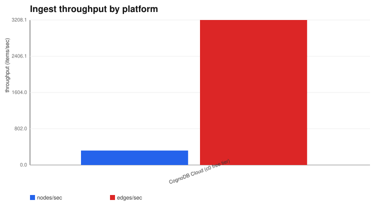
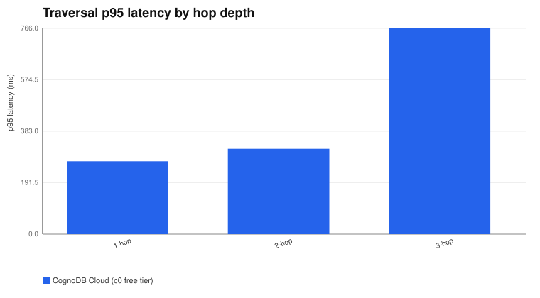
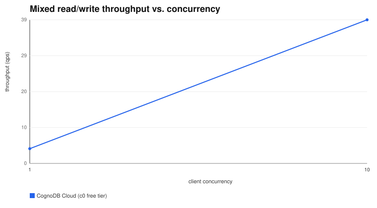

# Results Matrix

_Generated from 1 platform result file(s) in `results/raw/`._

## Data loading

| Platform | Total load time | Nodes/sec | Edges/sec | Nodes/Edges loaded |
|---|---|---|---|---|
| CognoDB Cloud (c0 free tier) | 114.60s | 320.2 | 3208.1 | 36692/367662 |

## Traversals (1/2/3-hop)

| Platform | Hop depth | p50 (ms) | p95 (ms) | Cold start (ms) | n |
|---|---|---|---|---|---|
| CognoDB Cloud (c0 free tier) | 1-hop | 245.759 | 271.253 | 240.133 | 50 |
| CognoDB Cloud (c0 free tier) | 2-hop | 255.464 | 317.827 | 265.161 | 50 |
| CognoDB Cloud (c0 free tier) | 3-hop | 438.811 | 766.049 | 656.959 | 50 |

## Lookups

| Platform | Query | p50 (ms) | p95 (ms) | Cold start (ms) | n |
|---|---|---|---|---|---|
| CognoDB Cloud (c0 free tier) | Point lookup | 259.014 | 278.738 | 240.479 | 100 |
| CognoDB Cloud (c0 free tier) | Indexed/filtered lookup | 273.945 | 301.789 | 293.210 | 100 |

## Aggregation (top-10 by out-degree)

| Platform | p50 (ms) | p95 (ms) | n |
|---|---|---|---|
| CognoDB Cloud (c0 free tier) | 1573.209 | 1715.397 | 100 |

## Mixed read/write workload

| Platform | Concurrency | Throughput (qps) | p50 (ms) | p95 (ms) | Total ops |
|---|---|---|---|---|---|
| CognoDB Cloud (c0 free tier) | 1 | 4.03 | 249.039 | 270.849 | 121 |
| CognoDB Cloud (c0 free tier) | 10 | 39.17 | 249.322 | 274.237 | 1175 |

## Storage / resource footprint

| Platform | Stored bytes (best-effort) | Notes |
|---|---|---|
| CognoDB Cloud (c0 free tier) | n/a | not observable on this tier/platform |

## Charts

